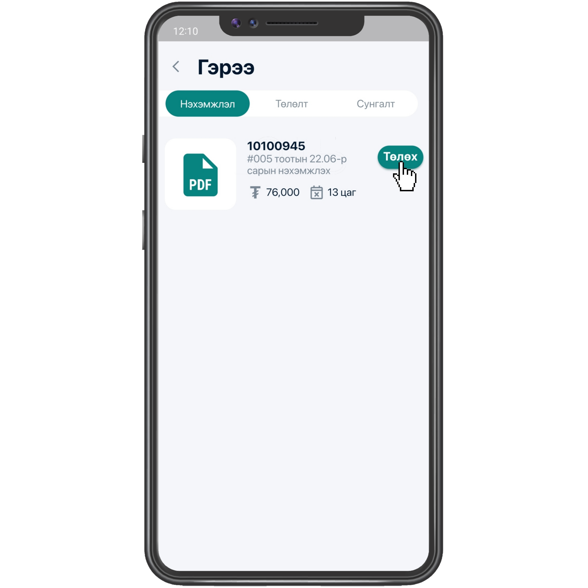
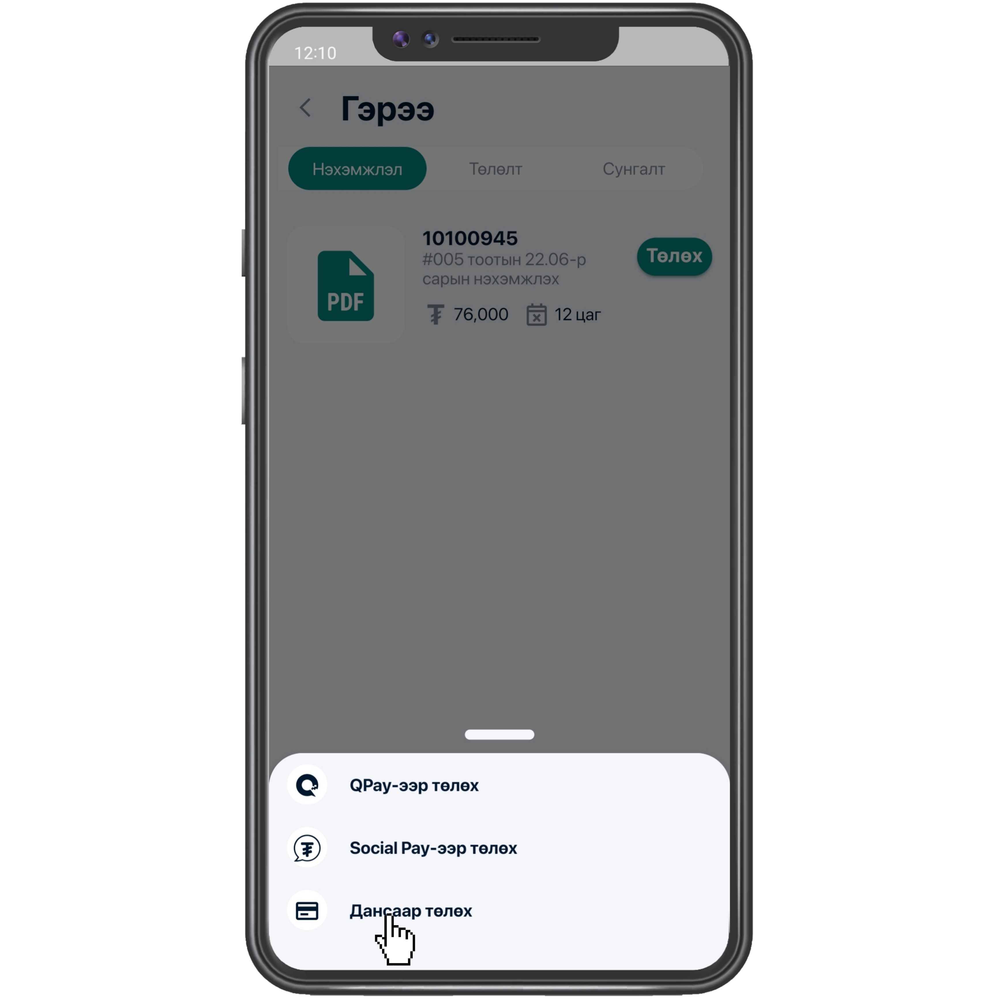
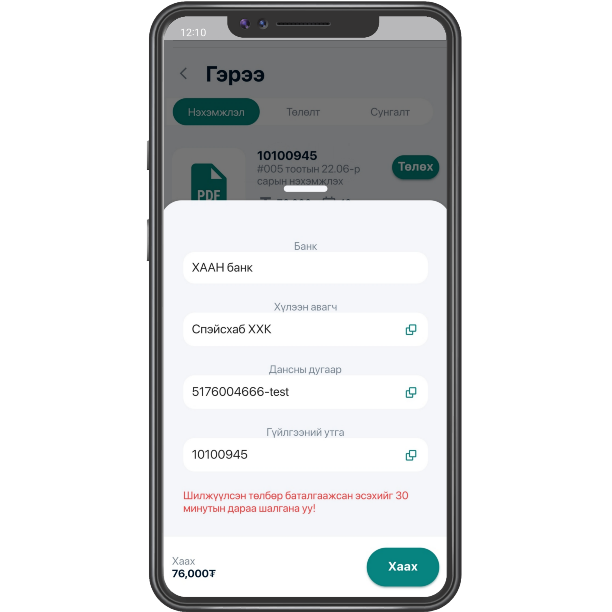

# 2.1. Төлбөр төлөх - Дансаар

/2.1.1/ Арга 1. Мессежээр данс ашиглан төлбөр төлөх

1\. Танд ирсэн мессеж дээрх дансны дугаар болон гүйлгээний утгыг зөв хуулж өөрийн ашигладаг банкны апп руу орон төлбөрөө төлнө.

.png>)

2\. Та дурын банкны аппыг ашиглан нэхэмжлэгчийн дансны дугаар луу төлбөрөө гүйлгээний утгатай зөв бичиж хийсэн тохиолдолд таны төлбөр амжилттай төлөгдөнө.

 (1).png>)

/2.1.2/ Арга 2. Spacehub app-р данс ашиглан төлбөр төлөх

1\. Дашборд дээр харагдаж буй төлбөр товч дээр дарна.

.png>)

&#x20;**** 2. Нэхэмжлэл рүү орж төлөх дээр дарснаар төлөх хэлбэрүүд гарч ирнэ.

&#x20;3\. Төлөх хэлбэрүүд дундаас дансаар төлөхийг нь сонгоно.

4\. Дансаар төлөхийг сонгосны дараа гарч ирэх мэдээллийг хуулж аван гүйлгээ хийнэ.

