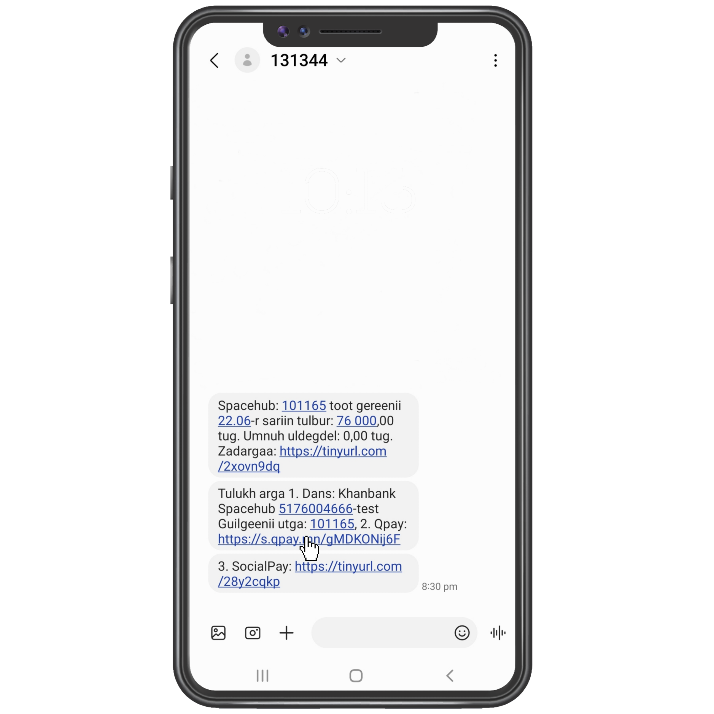
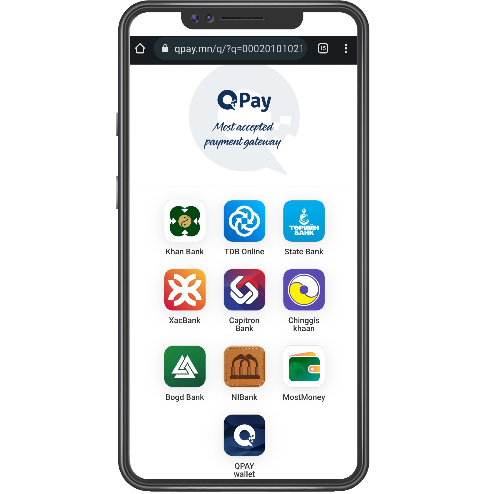

# 2.2. Төлбөр төлөх - Qpay ашиглан

/2.2.1/ Арга 1. Мессежээр qpay ашиглан төлбөр төлөх

1\. Танд ирсэн мессеж дэх Qpay холбоос дээр дарна.

2\. Тус холбоос дээр дарснаар төлбөр хийх банкуудын сонголт гарч ирнэ. Та энэ дундаас дурын банкаа сонгоно.

3\. Төлбөр хийх банкаа сонгох үед хүлээн авагчийн данс, төлбөрийн дүн болон гүйлгээний утга автоматаар бичигдэн орно. Зөв эсэхийг шалган үргэлжлүүлэх товчийг дарна.

.png>)

4\. Та гүйлгээний нууц үгээ хийснээр гүйлгээ амжилттай хийгдэнэ.

/2.2.2/ Арга 2. Spacehub app qpay ашиглан төлбөр төлөх

1\. Дашборд дээр харагдаж буй төлбөр гэсэн товч дээр дарна.&#x20;

 (1).png>)

2\. Нэхэмжлэл рүү орж төлөх дээр дарснаар төлөх хэлбэрүүд гарч ирнэ.

 (1).png>)

&#x20;3\. Төлөх хэлбэрүүд дундаас QPay-р төлөхийг сонгоно.

4\. Гүйлгээ хийх банкаа сонгож үргэлжлүүлнэ.\

5\. Төлбөр хийх банкаа сонгох үед хүлээн авагчийн данс, төлбөрийн дүн болон гүйлгээний утга автоматаар бичигдэн орно. Зөв эсэхийг шалган үргэлжлүүлэх товчийг дарна.

.png>).png>)

&#x20;6\. Та гүйлгээний нууц үгээ хийснээр гүйлгээ амжилттай хийгдэнэ.

.png>).png>)

